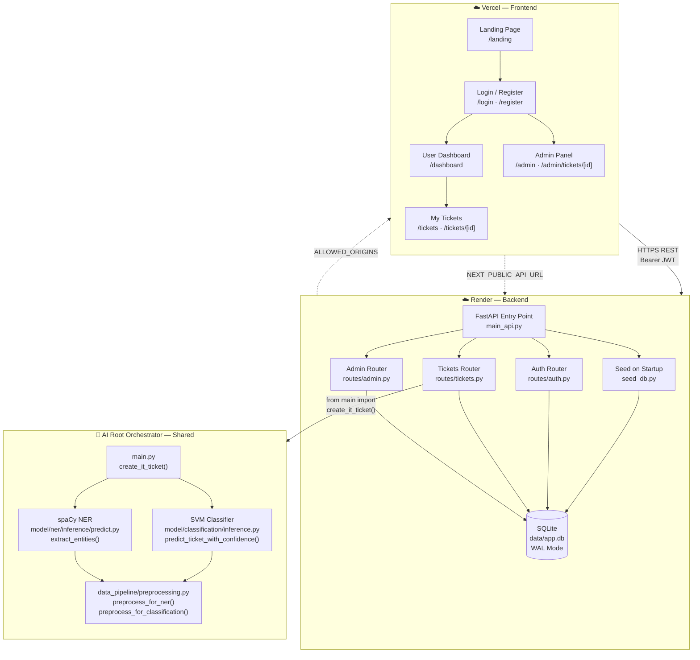
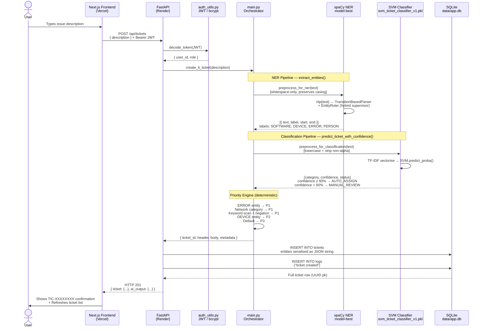

<div align="center">


# TicketAI

### AI-Powered IT Ticket Creation & Categorization

*Transforming unstructured IT complaints into structured, prioritized support tickets — automatically.*

[](https://your-app.vercel.app)
[](https://your-backend.onrender.com/api/docs)
[](https://your-backend.onrender.com/api/health)

> **Replace** `your-app.vercel.app` and `your-backend.onrender.com` with your actual deployed URLs.

</div>

---

## 📋 Quick Links

| Resource | URL |
|----------|-----|
| 🌐 **Live Application** | `https://your-app.vercel.app` |
| 📖 **API Documentation** | `https://your-backend.onrender.com/api/docs` |
| ❤️ **Health Endpoint** | `https://your-backend.onrender.com/api/health` |
| 🔁 **ReDoc** | `https://your-backend.onrender.com/api/redoc` |

---

## 🎯 Executive Overview

**TicketAI** is an enterprise-grade AI-SaaS platform that eliminates the friction of traditional IT helpdesk systems. Instead of forcing users to fill out forms, choose categories, and set priority levels — they simply describe their problem in plain English. TicketAI's AI pipeline instantly classifies the issue, assigns a priority, extracts key technical entities, and generates a fully structured, trackable support ticket.

### The Business Problem Solved

Traditional helpdesks lose critical hours to:
- Tickets submitted to wrong categories (misrouting)
- Manual priority assignment (subjective and slow)
- Unstructured descriptions that require back-and-forth clarification

### The TicketAI Solution

| Traditional Helpdesk | TicketAI |
|---------------------|----------|
| Users fill 5+ form fields | One plain-language text input |
| Manual category selection | Auto-classified by SVM (6 categories) |
| Admin manually sets priority | AI-assigned with 3-tier priority system |
| Tickets lost in queues | Real-time dashboard with filters and analytics |
| No confidence tracking | Confidence score + human-in-the-loop routing |

### Key Metrics

> **AI-driven** categorization · **< 10s** ticket creation · **6** issue categories · **3** priority tiers · **100%** tickets structured and tracked

---

## 🏗️ Architecture Diagram



---

## 🔄 Data Flow Diagram



---

## 🛠️ Tech Stack

### Frontend
[](https://nextjs.org/)
[](https://react.dev/)
[](https://www.typescriptlang.org/)
[](https://tailwindcss.com/)
[](https://tanstack.com/query)
[](https://www.framer.com/motion/)

### Backend
[](https://fastapi.tiangolo.com/)
[](https://python.org/)
[](https://sqlite.org/)
[](https://jwt.io/)

### AI / ML
[](https://spacy.io/)
[](https://scikit-learn.org/)
[](https://numpy.org/)

### Cloud
[](https://vercel.com/)
[](https://render.com/)

---

## 🧠 Core AI Implementation

### Model 1 — spaCy Named Entity Recognition (NER)

**Entry point:** `model/ner/inference/predict.py → extract_entities(text)`

The NER engine uses a **Hybrid Architecture** — a custom-trained statistical model reinforced by a deterministic Entity Ruler supervisor:

```
Raw Text
   │
   ▼
preprocess_for_ner()          ← Whitespace-only. Casing/punctuation PRESERVED
   │                             (critical for character offset accuracy)
   ▼
spaCy nlp(text)               ← TransitionBasedParser.v2 (trained model-best)
   │                             HashEmbedCNN.v2: width=96, depth=4
   ▼
EntityRuler (after ner pipe)  ← Hybrid Supervisor: overwrite_ents=True
   │                             Hardcoded patterns for macbook, laptop,
   │                             slack, teams, {DIGIT} error
   ▼
clean_entities()              ← Filter punctuation, single-char artifacts
   │
   ▼
[{ text, label, start, end }]  ← Labels: SOFTWARE, DEVICE, ERROR, PERSON, SYSTEM_ID
```

**Training config** (`model/ner/config/spacy_config.cfg`):
- Optimizer: Adam (lr=5e-4, warmup=250 steps)
- Max epochs: 30, patience: 1600 evaluations
- Score weight: F1 = 1.0 (precision/recall balanced via F1 only)
- Hardware: CPU (gpu_allocator = null)

**Lazy loading:** The model is loaded once on first call via a global singleton `_NLP`. All subsequent requests reuse the in-memory model — no reload overhead.

---

### Model 2 — SVM Text Classification

**Entry point:** `model/classification/inference.py → predict_ticket_with_confidence(text, threshold=0.60)`

```
Raw Text
   │
   ▼
preprocess_for_classification()  ← Lowercase + strip all non-alpha + collapse whitespace
   │
   ▼
TF-IDF Vectoriser                ← Embedded in svm_ticket_classifier_v1.pkl (3.5 MB)
   │
   ▼
SVM.predict_proba([vector])      ← Probability distribution over 6 classes
   │
   ├── confidence ≥ 60% ──► AUTO_ASSIGN
   │                         Returns (category, confidence, "AUTO_ASSIGN")
   │
   └── confidence < 60% ──► MANUAL_REVIEW
                             Logs to model/classification/manual_review_needed.txt
                             Returns (category, confidence, "MANUAL_REVIEW")
```

**6 Categories:** Software Issue · Hardware Issue · Network Issue · Access / Authentication Issue · Email & Communication Issue · General Support

**Pickle compatibility fix:** `sys.modules['__main__'].preprocess_text = preprocess_text` is injected at import time so `joblib.load()` can locate the preprocessing function that was baked into the serialized model.

---

### Priority Engine — Deterministic Rule Matrix

**Entry point:** `main.py → determine_priority(text, category, entities)`

The priority engine is **not ML** — it's a deterministic rule chain applied after both AI models complete:

| Rule | Condition | Priority |
|------|-----------|----------|
| 1 — Hard Error Evidence | Any entity with `label == "ERROR"` (from NER) | **P1 - Critical** |
| 2 — Broad Impact | SVM predicted `"Network Issue"` | **P1 - Critical** |
| 3 — Keyword Scan | Words: `urgent`, `blocked`, `asap`, `down`, `crash`, `critical` — with **negation look-back** (2-word window) | **P1 - Critical** |
| 4 — Physical Asset | Any entity with `label == "DEVICE"` (from NER) | **P2 - Medium** |
| 5 — Default | No high-signal triggers found | **P3 - Low** |

> **Negation handling:** *"system is not critical"* correctly resolves to P3 because `not` appears within the 2-word window before `critical`. *"system is down, not a big issue"* still resolves to P1 because `down` has no negation preceding it.

---

### AI Orchestrator

**Entry point:** `main.py → create_it_ticket(user_input)`

This is the **central coordinator** — imported by `ui/backend/routes/tickets.py` via cross-directory resolution at startup:

```python
# ui/backend/routes/tickets.py line 20
from main import create_it_ticket  # ← resolves to project ROOT main.py
```

The orchestrator applies a **second-pass entity filter** (`clean_entities()` in `main.py`) on top of the NER results — removing pronouns ("it", "this", "that") and entities under 2 characters — before passing to the priority engine.

---

## 🗄️ Database Schema

**Engine:** SQLite · WAL journal mode · All primary keys: `TEXT UUID`

```sql
-- users: authentication and role management
CREATE TABLE users (
    id          TEXT PRIMARY KEY,          -- UUID (uuid4)
    email       TEXT UNIQUE NOT NULL,
    password    TEXT NOT NULL,             -- bcrypt hash
    full_name   TEXT,
    role        TEXT NOT NULL DEFAULT 'user',  -- 'user' | 'admin'
    created_at  TEXT NOT NULL
);

-- tickets: core domain table
CREATE TABLE tickets (
    id          TEXT PRIMARY KEY,          -- UUID (internal, used in API routes)
    ticket_id   TEXT UNIQUE NOT NULL,      -- TIC-XXXXXXXX (user-facing)
    user_id     TEXT REFERENCES users(id),
    title       TEXT NOT NULL,             -- AI-generated: "{category}: Issue involving {subject}"
    description TEXT NOT NULL,            -- Raw user input preserved
    category    TEXT NOT NULL,             -- SVM prediction
    priority    TEXT NOT NULL,             -- Deterministic rule engine
    status      TEXT NOT NULL DEFAULT 'OPEN',
    entities    TEXT DEFAULT '[]',         -- JSON-serialised NER results
    confidence  REAL DEFAULT 0.0,          -- SVM confidence score (0.0–1.0)
    created_at  TEXT NOT NULL,
    updated_at  TEXT NOT NULL
);

-- logs: immutable audit trail
CREATE TABLE logs (
    id          TEXT PRIMARY KEY,
    actor_id    TEXT REFERENCES users(id),
    action      TEXT NOT NULL,             -- e.g. "ticket.created", "admin.ticket.updated"
    target_id   TEXT,
    metadata    TEXT DEFAULT '{}',         -- JSON
    created_at  TEXT NOT NULL
);
```

> **Note:** The `ticket_messages` table is defined in the schema but has no active API routes in the current version.

---

## ☁️ Cloud Infrastructure & Persistence

### Deployment Architecture

```
┌─────────────────────────────────────────────────────────────┐
│  Vercel (Frontend)                Render (Backend)           │
│                                                             │
│  ui/frontend/              ──►   ui/backend/                │
│  Next.js 16 App Router           FastAPI + uvicorn           │
│  Static + SSR                    Python 3.11                │
│                                                             │
│  NEXT_PUBLIC_API_URL  ──────────►  ALLOWED_ORIGINS          │
│  (Render URL)                       (Vercel URL)            │
└─────────────────────────────────────────────────────────────┘
```

### ⚠️ SQLite Persistence Warning

Render's free tier uses **ephemeral storage** — the filesystem (and SQLite DB at `ui/backend/data/app.db`) is **wiped on every restart or redeploy**.

### Self-Healing Account Seeding

To solve the ephemeral storage problem, `ui/backend/seed_db.py` runs **automatically on every startup**, immediately after `init_db()`, before any request is served:

```python
# ui/backend/main_api.py — startup sequence
init_db()          # CREATE TABLE IF NOT EXISTS (idempotent schema)
seed()             # CREATE user IF NOT EXISTS (idempotent accounts)
# → app registers routes and begins serving requests
```

The seed function is idempotent — it calls `get_user_by_email()` first, and only calls `create_user()` if the account does not already exist. Safe to run on every startup including local development.

### Environment Variables — Render Configuration

Set all of these in your Render service → **Environment** tab:

| Variable | Description | Example Value |
|----------|-------------|---------------|
| `JWT_SECRET` | Secret key for signing JWT tokens | `openssl rand -hex 32` output |
| `ALLOWED_ORIGINS` | CORS whitelist (comma-separated) | `https://your-app.vercel.app,http://localhost:3000` |
| `ADMIN_EMAIL` | Admin account login email | `admin@yourcompany.com` |
| `ADMIN_PASSWORD` | Admin account password (**change this!**) | `StrongAdminPass@2026` |
| `ADMIN_NAME` | Admin display name | `Admin` |
| `SEED_USER_EMAIL` | Demo user login email | `user@yourcompany.com` |
| `SEED_USER_PASSWORD` | Demo user password (**change this!**) | `StrongUserPass@2026` |
| `SEED_USER_NAME` | Demo user display name | `Demo User` |
| `PYTHON_VERSION` | Pin Python runtime on Render | `3.11.0` |

> **Security:** Never commit real passwords to Git. The defaults in `seed_db.py` are development fallbacks only.

---

## 🗂️ Project Structure

```
ai-ticket-creation-and-categorization/          ← Monorepo Root
│
├── main.py                                      ← AI Orchestrator (create_it_ticket)
├── render_build.sh                              ← Render build script
│
├── data_pipeline/
│   └── preprocessing.py                         ← preprocess_for_ner() · preprocess_for_classification()
│
├── model/
│   ├── ner/
│   │   ├── config/spacy_config.cfg              ← Training config (Adam, HashEmbedCNN)
│   │   ├── inference/
│   │   │   ├── __init__.py                      ← Exports extract_entities
│   │   │   └── predict.py                       ← extract_entities() + EntityRuler hybrid
│   │   └── models/model-best/                   ← Trained spaCy model artifact (binary)
│   └── classification/
│       ├── inference.py                         ← predict_ticket_with_confidence()
│       └── svm_ticket_classifier_v1.pkl         ← TF-IDF + SVM (3.5 MB, joblib)
│
└── ui/
    ├── frontend/                                ← Next.js 16 (Vercel)
    │   ├── app/
    │   │   ├── landing/page.tsx                 ← Public landing page
    │   │   ├── login/page.tsx                   ← Auth with role-based redirect
    │   │   ├── register/page.tsx
    │   │   ├── dashboard/                       ← User: raise + track tickets
    │   │   ├── tickets/[id]/page.tsx            ← User ticket detail
    │   │   └── admin/
    │   │       ├── page.tsx                     ← Admin dashboard + analytics
    │   │       ├── tickets/page.tsx             ← Redirect → /admin
    │   │       └── tickets/[id]/page.tsx        ← Admin ticket detail (editable)
    │   ├── components/
    │   │   ├── layout/AppSidebar.tsx            ← Role-aware nav (isAdmin guard)
    │   │   └── shared/Badges.tsx                ← PriorityBadge · StatusBadge · ConfidenceBar
    │   ├── context/AuthContext.tsx              ← JWT in localStorage, /api/auth/me rehydration
    │   └── lib/api.ts                           ← Typed API client (NEXT_PUBLIC_API_URL)
    │
    └── backend/                                 ← FastAPI (Render)
        ├── main_api.py                          ← Entry point: init_db → seed → app
        ├── database.py                          ← SQLite abstraction (WAL, UUID PKs)
        ├── models.py                            ← Pydantic v2 schemas
        ├── auth_utils.py                        ← bcrypt + jose JWT (HS256, 24h)
        ├── deps.py                              ← get_current_user · require_admin (FastAPI DI)
        ├── seed_db.py                           ← Idempotent startup seeder (6 env vars)
        ├── requirements.txt                     ← Pinned Python dependencies
        └── routes/
            ├── auth.py                          ← /api/auth/register · /login · /me
            ├── tickets.py                       ← /api/tickets (CRUD + AI pipeline call)
            └── admin.py                         ← /api/admin/tickets · /analytics · /users · /logs
```

---

## 🚀 Setup & Development

### Prerequisites

- Node.js 20+
- Python 3.11+
- Git

### 1. Clone the repository

```bash
git clone https://github.com/your-username/ai-ticket-creation-and-categorization.git
cd ai-ticket-creation-and-categorization
```

### 2. Backend Setup

```bash
cd ui/backend

# Create and activate virtual environment
python -m venv .venv
.venv\Scripts\activate        # Windows
# source .venv/bin/activate   # macOS/Linux

# Install dependencies
pip install -r requirements.txt

# Download spaCy language model
python -m spacy download en_core_web_sm

# Create .env file
cp .env.example .env
# Edit .env — set JWT_SECRET to a strong random string

# Start backend (run from ui/backend/)
uvicorn main_api:app --reload --port 8000
```

Backend available at: `http://localhost:8000`
API docs available at: `http://localhost:8000/api/docs`

### 3. Frontend Setup

```bash
# Open a new terminal
cd ui/frontend

# Install dependencies
npm install

# Create .env.local
echo "NEXT_PUBLIC_API_URL=http://localhost:8000" > .env.local

# Start frontend
npm run dev
```

Frontend available at: `http://localhost:3000`

### 4. Seed Default Accounts (optional — runs automatically)

The seed runs automatically on every backend startup. To run it manually:

```bash
cd ui/backend
python seed_db.py
```

Default accounts (override via `.env`):

| Role | Email | Password |
|------|-------|----------|
| Admin | `admin@ticketai.com` | `Admin@1234` |
| User | `user@ticketai.com` | `User@1234` |

---

## 🌐 Production Deployment

### Backend → Render

| Setting | Value |
|---------|-------|
| **Runtime** | Python 3 |
| **Root Directory** | *(leave blank — must be repo root)* |
| **Build Command** | `bash render_build.sh` |
| **Start Command** | `cd ui/backend && uvicorn main_api:app --host 0.0.0.0 --port $PORT` |
| **Instance Type** | Free |

> **Root directory must be blank.** The AI models at `model/` and `data_pipeline/` are resolved relative to the project root via `Path(__file__).resolve().parents[N]`. Setting root to `ui/backend` breaks these paths.

### Frontend → Vercel

| Setting | Value |
|---------|-------|
| **Framework Preset** | Next.js (auto-detected) |
| **Root Directory** | `ui/frontend` |
| **Build Command** | `npm run build` |
| **Environment Variable** | `NEXT_PUBLIC_API_URL` = your Render URL |

### Deployment Order

```
1. Deploy backend on Render → get your Render URL
2. Deploy frontend on Vercel → set NEXT_PUBLIC_API_URL = Render URL
3. Get your Vercel URL → go back to Render
4. Set ALLOWED_ORIGINS = https://your-app.vercel.app,http://localhost:3000
5. Trigger a Render redeploy
```

---

## 🔌 API Reference

All endpoints require `Authorization: Bearer <token>` except `/api/auth/*`.

### Authentication

| Method | Endpoint | Description |
|--------|----------|-------------|
| `POST` | `/api/auth/register` | Register new user |
| `POST` | `/api/auth/login` | Login, returns JWT |
| `GET` | `/api/auth/me` | Get current user profile |

### Tickets (User)

| Method | Endpoint | Description |
|--------|----------|-------------|
| `POST` | `/api/tickets` | Create ticket via AI pipeline |
| `GET` | `/api/tickets` | List own tickets (paginated) |
| `GET` | `/api/tickets/{id}` | Get ticket detail (UUID or TIC-XXXX) |
| `PUT` | `/api/tickets/{id}` | Update own ticket |

### Admin

| Method | Endpoint | Description |
|--------|----------|-------------|
| `GET` | `/api/admin/tickets` | List all tickets (filterable) |
| `GET` | `/api/admin/tickets/{id}` | Get any ticket detail |
| `PUT` | `/api/admin/tickets/{id}` | Update any ticket |
| `DELETE` | `/api/admin/tickets/{id}` | Delete ticket |
| `GET` | `/api/admin/analytics` | System-wide stats |
| `GET` | `/api/admin/users` | List all users |
| `PUT` | `/api/admin/users/{id}/role` | Promote/demote user |
| `GET` | `/api/admin/logs` | Activity audit log |
| `GET` | `/api/health` | Health check |

---

## 🔒 Security

- **Passwords:** Hashed with `bcrypt` (salt rounds auto-managed)
- **Tokens:** JWT signed with `HS256`, 24-hour expiry, verified on every protected request
- **Role enforcement:** `require_admin` FastAPI dependency applied to all `/api/admin/*` routes
- **Ownership check:** Users can only access/modify their own tickets (bypassed for admins)
- **CORS:** Origin whitelist controlled by `ALLOWED_ORIGINS` environment variable — no wildcard in production
- **Secrets:** `JWT_SECRET` loaded from environment variable — never hardcoded in source

---

## ⚠️ Known Limitations

| Limitation | Detail |
|-----------|--------|
| **SQLite Ephemerality** | Render free tier wipes the DB on restart. Mitigated by `seed_db.py` for accounts; ticket data is lost. Upgrade to Render Disk ($1/mo) or Supabase for persistence. |
| **Cold Starts** | Render free tier spins down after 15 min idle. First request takes 30–50s (spaCy + SVM model load). |
| **ML Inference Speed** | spaCy model (~40 MB) + SVM pickle (~3.5 MB) load once at startup. Per-request inference is fast (~50–200ms). |
| **`ticket_messages` Table** | Schema exists but no API routes are implemented in this version. |

---

## 👥 Team

Built under the **Infosys Springboard 6.0 AI Internship Program**.

| Area | Contribution |
|------|-------------|
| AI Orchestration & ML Lead | Arya Kumar |
| SVM Classification | Bhavya Sree Pasumarthi |
| Data Pipeline & NER Preprocessing | Addagada Dinesh |
| Full-Stack UI & API Integration | Team |

---

## 📄 License

MIT License — Copyright © 2026 Vidzai Digital

Permission is hereby granted, free of charge, to any person obtaining a copy of this software and associated documentation files (the "Software"), to deal in the Software without restriction, including without limitation the rights to use, copy, modify, merge, publish, distribute, sublicense, and/or sell copies of the Software, and to permit persons to whom the Software is furnished to do so, subject to the following conditions:

The above copyright notice and this permission notice shall be included in all copies or substantial portions of the Software.

THE SOFTWARE IS PROVIDED "AS IS", WITHOUT WARRANTY OF ANY KIND, EXPRESS OR IMPLIED.

---

<div align="center">

**TicketAI** · Built with FastAPI · Next.js · Python AI/ML · Deployed on Vercel + Render

*Infosys Springboard 6.0 · AI Internship Project · 2026*

</div>
